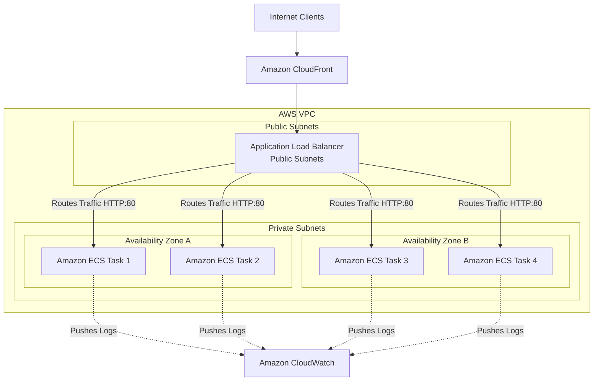

# AWS ECS with Application Load Balancer (ALB) Infrastructure

This directory contains the Infrastructure as Code (IaC) configuration for deploying containerized applications on AWS ECS (Elastic Container Service) Fargate, fronted by an AWS Application Load Balancer (ALB).

## Project Overview

The project provisions a scalable, secure, and highly-available containerized application environment. Using **Terraform** for infrastructure definition, the setup ensures consistent environment provisioning (Dev, Staging, Prod) and integrates with a **GitLab CI/CD** pipeline for automated application building and local lab deployment.

---

## Architecture

The diagram below represents the target architecture designed in [aws-diagram.drawio](infrastructure/aws-diagram.drawio).

### Architecture Diagram



### Flow of Traffic
1. **Ingress**: Public user traffic hits **Amazon CloudFront** (serving as a Content Delivery Network/CDN).
2. **Routing**: CloudFront forwards requests to the **Application Load Balancer (ALB)** residing in the Public Subnets.
3. **Load Balancing**: The ALB terminates HTTP traffic on port 80 and forwards requests to the **Amazon ECS Fargate tasks** across multiple Availability Zones (AZs) using IP-based routing.
4. **Logging**: Container stdout/stderr logs are stream-shipped directly to **Amazon CloudWatch** via the `awslogs` log driver for monitoring and troubleshooting.

> [!NOTE]
> **Environment Specifics**: While the architecture diagram and standard production practices place the ECS tasks within the Private Subnets using a NAT Gateway for outbound traffic, the current `dev` environment configuration deploys ECS Fargate tasks directly to Public Subnets with public IP assignments to minimize NAT Gateway data processing costs during development.

---

## Directory Structure

```text
infrastructure/
├── .gitlab-ci.yml             # GitLab CI/CD pipeline definitions
├── aws-diagram.drawio         # Draw.io architectural diagram source
├── environments/
│   ├── dev/                   # Development environment configuration
│   │   ├── backend.tf
│   │   ├── main.tf            # Main module orchestrator
│   │   ├── outputs.tf
│   │   ├── provider.tf
│   │   ├── terraform.tfvars
│   │   └── variables.tf
│   ├── stg/                   # Staging environment configuration
│   │   ├── backend.tf
│   │   ├── main.tf
│   │   ├── outputs.tf
│   │   ├── provider.tf
│   │   ├── terraform.tfvars
│   │   └── variables.tf
│   └── prod/                  # Production environment configuration
│       ├── backend.tf
│       ├── main.tf
│       ├── outputs.tf
│       ├── provider.tf
│       ├── terraform.tfvars
│       └── variables.tf
└── modules/
    ├── ecs/                   # ECS Cluster, Fargate Task Definition, and ECS Service
    ├── elb/                   # ALB, HTTP Listener, and Target Group
    ├── iam/                   # ECS Task Execution Role and Policies
    ├── sg/                    # Security Groups for ALB and ECS Tasks
    └── vpc/                   # VPC, Subnets, IGW, NAT Gateway, and Route Tables
```

---

## Infrastructure Components (Modules)

### 1. VPC Module (`modules/vpc`)
Provisions the underlying network structure:
- **VPC**: `10.0.0.0/16` CIDR block.
- **Subnets**: 
  - 2 Public Subnets (`10.0.1.0/24`, `10.0.2.0/24`) spanned across 2 availability zones (AZ `a` and `b`) for high-availability frontend/load-balancer access.
  - 2 Private Subnets (`10.0.3.0/24`, `10.0.4.0/24`) across 2 AZs for database/backend isolation.
- **Gateways**: Internet Gateway (IGW) for public routing, and a NAT Gateway (with Elastic IP allocation) associated with the public subnets to provide internet access for private subnets.

### 2. Elastic Load Balancing Module (`modules/elb`)
Defines the client-facing access point:
- **ALB**: Deployed in public subnets, using the ALB Security Group.
- **Target Group**: Type `ip` (required for Fargate `awsvpc` network mode), HTTP protocol, and configurable health checks.
- **Listener**: Listens on Port 80 and forwards requests to the target group.

### 3. ECS Module (`modules/ecs`)
Handles the container execution:
- **ECS Cluster**: Logical grouping of Fargate services.
- **Task Definition**: Fargate compatibility, `awsvpc` network mode, custom CPU/Memory resource constraints, and integration with CloudWatch log groups.
- **ECS Service**: Deploys a specified desired number of container tasks, manages health check grace periods, and integrates with the Target Group.

### 4. Security Groups Module (`modules/sg`)
Handles firewall rules:
- **ALB SG**: Allows inbound traffic from anywhere on port 80.
- **ECS Tasks SG**: Restricts inbound traffic, **only** allowing ingress from the ALB Security Group on the application's specific `container_port` (standard defense-in-depth practice).

### 5. IAM Module (`modules/iam`)
- **ECS Task Execution Role**: Assumed by `ecs-tasks.amazonaws.com`. Attaches the AWS-managed policy `AmazonECSTaskExecutionRolePolicy` to allow container tasks to pull images from AWS ECR and push logs to CloudWatch.

---

## CI/CD Pipeline (`.gitlab-ci.yml`)

The infrastructure repository contains a GitLab CI/CD configuration to automate container builds:
- **Stages**:
  - `buildandpush`: Logs into the Docker registry, builds the Docker image from the source, and tags/pushes it to the registry.
  - `deploy`: Pulls the container image onto the deployment runner (`lab-server`) and runs it locally on port `8080` (for testing/lab execution).
  - `showlog`: Pauses for 20 seconds and fetches the container logs to verify startup status.
- **Execution**: Triggered only on Git tag releases (`only: - tags`).

---

## How to Deploy the Infrastructure

1. **Prerequisites**:
   - Install [Terraform](https://www.terraform.io/downloads).
   - Configure your AWS credentials (`aws configure` or environment variables).

2. **Navigate to the target environment**:
   Choose the environment (`dev`, `stg`, or `prod`):
   ```bash
   cd infrastructure/environments/<dev|stg|prod>
   ```

3. **Initialize Terraform**:
   ```bash
   terraform init
   ```

4. **Verify Plan**:
   ```bash
   terraform plan -var="container_image=<YOUR_ECR_IMAGE_URL>"
   ```

5. **Apply configuration**:
   ```bash
   terraform apply -var="container_image=<YOUR_ECR_IMAGE_URL>"
   ```
